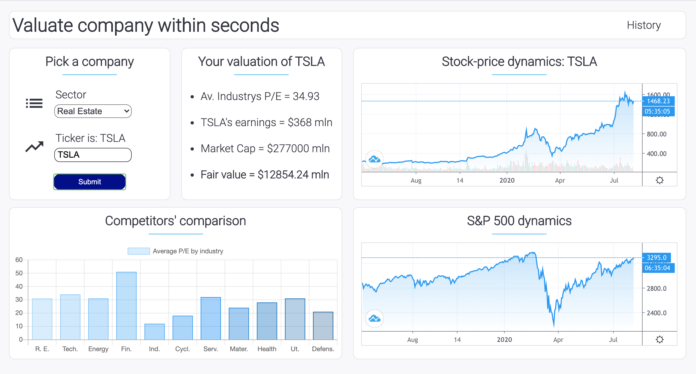

Веб-приложение для экспресс оценки стоиомсти компании в рамках сравнительного подхода - методом рынка капиталов. Для заданного тикера компании из S&P 500, через API находятся прямые публичные компании-конкуренты, для которых в дальнейшем рассчитывается медианный мультипликатор EV/EBITDA, по которому происходит рыночная оценка стоимости заданной компании.

Помимо этого, в левом нижнем углу UI выводистя сравнительная гистограмма по секторальному YTD, где красным цветом выделяется сектор, в котором оперирует исследуемся компания. В правом верхнем углу выводится график рыночной цены для заданной компании в режиме реального времени, а в правом нижнем - график широкого рынка - S&P 500 в целях наглядности и сопоставимости полученных данных.

Проект выполнен на фреймворке Angular + RxJS.

